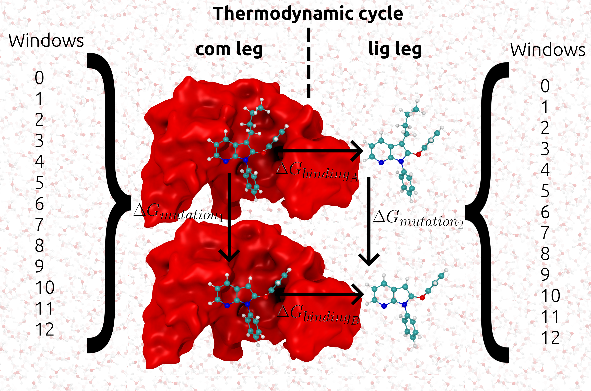

Binding Free Energy Tutorial
============================

General BFE background
----------------------

The discussion in the :ref:`Tutorial` section outlines performing one alchemical simulation with ``TIES_MD``
for a binding free energy calculation we need two alchemical simulations. We call these two simulations
the complex and ligand simulations shortened to com and lig respectively. The lig simulation transforms one ligand A
into another B in water the com simulation does the same but now inside the protein. The com and lig simulations
give us :math:`{Δ G_{mutation1}}` and :math:`{Δ G_{mutation2}}` respectively the difference of these values is equal
to the binding free energy :math:`{ΔΔ G}`. This idea of complex and ligand simulations relating to the difference
in binding free energy is shown in the following figure:

More details of these methods can be found in the publications of `Cournia et al. <https://pubs.acs.org/doi/full/10.1021/acs.jcim.7b00564>`_.
When we discuss the running of X replica simulations this whole thermodynamic cycle is run X times. To run the com and
lig simulations these must be setup by hand or by using ``TIES20``. Setting up the lig and com simulations follows the same
principles as discussed in the :ref:`Tutorial` section. Some additional ideas however are that a constraints file is normally
used for the com simulation, this is included to avoid rapid changes of the protein crystal structure conformation early
in the simulation, caused by close atom contacts. Also the com simulation will contain more atoms and so be more expensive
computationally.

Setup
-----

To set up these calculation we recommend the use of ``TIES20``. This is a program designed to both build and parameterize
hybrid ligands but also setup binding free energy calculations for the TIES protocol that can be run with ``TIES_MD``.
``TIES20`` can be used in `browser <https://ccs-ties.org/ties/>`_. Alternatively one can use the ``TIES20`` API to set up
simulations. In order to use the API ``TIES20`` must be installed locally please see the `TIES20 git. <https://github.com/UCL-CCS/TIES20>`_
for how to do this. With ``TIES20`` installed you can use the API as follows to build inputs::

    #ties20 imports
    from ties import Pair, Config, Ligand, Protein

    #Setting for system building
    config = Config()
    config.ligand_ff_name = 'gaff2'
    config.ligand_net_charge = 0
    config.md_engine = 'openmm'

    #prep ligandA
    ligandA = Ligand('ligandA.mol2', config=config)
    ligandA.antechamber_prepare_mol2()

    #prep ligandB
    ligandB = Ligand('ligandB.mol2', config=config)
    ligandB.antechamber_prepare_mol2()

    #make ligandA and ligandB into a pair
    pair = Pair(ligandA, ligandB, ligand_net_charge=config.ligand_net_charge, config=config)

    #ensure the names of all atoms are different (needed for hybridizing)
    pair.make_atom_names_unique()

    #turn the pair into a hybrid
    hybrid = pair.superimpose()

    #Since no protein is declared this will build lig simulation
    hybrid.prepare_inputs()

    #now declare protein
    config.protein = 'receptor.pdb'
    config.protein_ff = 'leaprc.protein.ff14SB'
    protein = Protein(config)

    #re-prepare simulation input, now protein is declared and passed as argument com simulation is built
    hybrid.prepare_inputs(protein=protein)

This will build all the input needed to run a BFE calculation for the :math:`{ΔΔ G}` between ligandA and
ligandB. However, in order to run at this point the user must execute their own HPC submission scripts or run via the
command line on a cluster. We can however build own submission scripts and or change any of the simulation setting
as detailed in the next section.

Running
-------

At this point we have prepped a simulation of one thermodynamic cycle with two legs named lig and com. ``TIES20`` will
set these legs up in the directories ``ties/ties-ligandA-ligandB/(lig/com)`` and these map to the
``system/ligand/thermodynamic_leg/`` directory structure that was discussed in the :ref:`Tutorial` section.
In ``ties/ties-ligandA-ligandB/(lig/com)`` there will be the ``build`` directory and  ``TIES.cfg`` files as also seen in
the :ref:`Tutorial`. The automatic settings in ``TIES.cfg`` will be good for a default simulation but in general we may wish to
change these quickly and or write submission scripts for these simulations. To do this we can use the ``TIES_MD`` API as
follows::

    #tiesMD imports
    from TIES_MD import TIES
    import os

    #iterate over both legs of BFE calculation
    for thermo_leg in ['com', 'lig']:
        #point to the simulation directory
        ties_dir = os.path.join(os.getcwd(), 'ties', 'ties-ligandA-ligandB', thermo_leg)

        #read the default TIES.cfg to initialize
        md = TIES(ties_dir)

        #change some settings in TIES.cfg
        md.split_run = 1
        md.total_reps = 6

        #inspect all the options we can configure and change
        md.get_options()

        #change the header of generated submission scripts
        md.sub_header = """#Example script for Summit OpenMM
    #BSUB -P CHM155_001
    #BSUB -W 120
    #BSUB -nnodes 13
    #BSUB -alloc_flags "gpudefault smt1"
    #BSUB -J LIGPAIR
    #BSUB -o oLIGPAIR.%J
    #BSUB -e eLIGPAIR.%J"""

        #Setting HPC specific elements of run line (example here is Summit)
        md.pre_run_line = 'jsrun --smpiargs="off" -n 1 -a 1 -c 1 -g 1 -b packed:1 '

        #Setting ties_md part of run line
        md.run_line = 'ties_md --config_file=$ties_dir/TIES.cfg --windows_mask=$lambda,$(expr $lambda + 1) --node_id=$i'

        #setup the new simulation with changed options (also writes submission script)
        md.setup()

This changes the TIES.cfg options ``split_run`` to 1 (True) and ``total_reps`` to 6. To see all configurable options the user
can run ``md.get_options()`` as shown above. To generate a general submission script we are modifying the
``sub_header``, ``pre_run_line`` and ``run_line`` internal options and these set what ``TIES_MD`` writes into the
submission script, for more details see :ref:`API`. These scripts can be summited to the HPC scheduler, once they
finish the last step to get a :math:`{ΔΔ G}` is analysis.

BFE Analysis
------------

Once the simulations are finished the analysis can be performed as discussed in the :ref:`Tutorial` section. If we are in
the ``ties/ties-ligandA-ligandB/(lig/com)`` directory run::

    cd ../../..
    ties_ana --run_type=setup

Then modify the analysis.cfg file such the legs option is now to ``legs = lig, com`` (the two legs of our cycle). Note,
configured like this the :math:`{ΔΔ G}` is computed as the :math:`{Δ G}` of the ligand simulation minus the :math:`{Δ G}`
of the complex simulation, take care this gives you the same :math:`{ΔΔ G}` as you want to compare to in experiment
and it depends on which ligand is ligandA/B in the cycle. Running the following command will once again give
a ``results.dat`` file as output::

    ties_ana

``results.dat`` file file will have the same format as in the :ref:`Tutorial` section but it now
contains the :math:`{ΔΔ G}` of each transformation and the associated standard error of the mean (SEM). The print out on
the terminal  will detail the individual :math:`{Δ G}` results for each thermodynamic leg.
