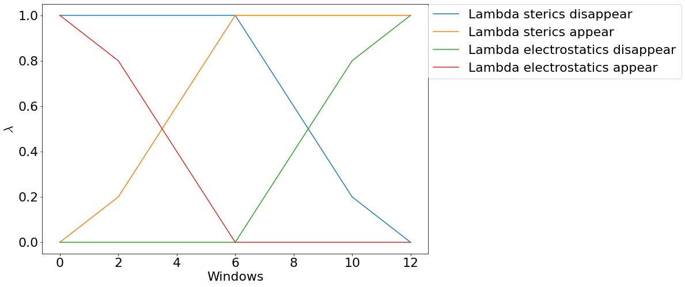

Theory
========

Outline
--------

``TIES`` or `thermodynamic integration <http://alchemistry.org/wiki/Thermodynamic_Integration>`_ with enhanced sampling is a method
for calculating binding free energies. This document considers the application of ``TIES`` to calculate binding
free energies between a target protein and small molecule which binds non-covalently to that protein.
Specifically we will be calculating `relative binding <http://alchemistry.org/wiki/Example:_Relative_Binding_Affinity>`_ free
energies using a `dual topology <http://alchemistry.org/wiki/Constructing_a_Pathway_of_Intermediate_States#Topologies>`_ approach.
Dual topology refers to how the small molecules input to the simulation are built, we do not consider the details of this theory here,
but more information can be found in the publications for `TIES20 <https://pubs.acs.org/doi/10.1021/acs.jctc.0c01179>`_.
(``TIES 20`` is a complementary program to ``TIES MD`` and can generate all the input needed for ``TIES MD``, including dual
topology small molecules).

Alchemical Calculations
-----------------------

To calculate relative binding free energies ``TIES MD`` uses an `alchemical <http://alchemistry.org/wiki/Main_Page>`_ approach.
This involves changing chemical moieties of the dual topology ligand to transform it from one physical ligand A to another B.
Generally this transformations involves 'creating' a set of appearing atoms an 'destroying' a set of disappearing atoms.
This transformation is stratified into finite steps along the path from A to B each step along the path is called
an alchemical window or state. Details on how these states should be chosen can be found `here <http://alchemistry.org/wiki/Constructing_a_Pathway_of_Intermediate_States>`_.
To keep track of what state is being simulated a control parameter ``λ`` is chosen. When ``λ`` takes a value of 0 then the simulation
contains ligand A and when ``λ`` takes the value of 1 the simulation contains ligand B. For intermediate value of ``λ`` the system
contains some alchemical hybrid of ligands A and B.

Alchemical Pathways
-------------------

As a user of ``TIES MD`` three options can be used to tune the alchemical path way between the A and B end states. These are
``global_lambdas``, ``ster_edges`` and ``elec_edges`` and these options are provided in the :ref:`Input` config file. ``global_lambdas``
is input as comma separate list of floats, each value in the list sets the value of the control parameter ``λ``
in each alchemical window, ``ster_edges`` and ``elec_edges`` determine how exactly the Lennard-Jones (LJ) and electrostatic interactions
are scaled along the alchemical path way. ``ster_edges`` for example is input as two floats separated by a comma
(e.g. ``ster_edges = x, y``) the first float, ``x``, determines for what value of ``λ`` the LJ interactions of the
appearing atoms begin to appear, the second float, ``y``, determines when the LJ of the appearing atoms are fully appeared.
The disappearing atoms will begin disappearing when ``λ=1-x`` and be fully disappeared when ``λ=1-y``. This is best shown graphically
and figure 1 plots the lambda schedule for ``ster_edges = 0.0, 0.5`` and ``elec_edges = 0.5, 1.0`` with ``global_lambdas =
0.0, 0.08, 0.17, 0.25, 0.33, 0.42, 0.5, 0.58, 0.67, 0.75, 0.83, 0.92, 1.0``.

For the ``NAMD`` implementation of alchemical pathways and the associated options there we recommend consulting the
`NAMD user guide <https://www.ks.uiuc.edu/Research/namd/2.10/ug/node62.html>`_.