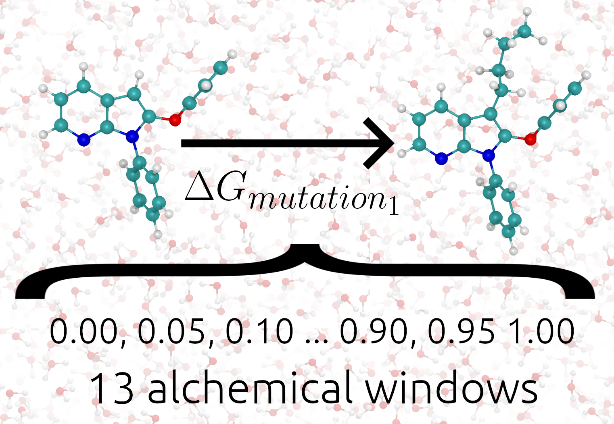

Tutorial
=========

Getting started
---------------

``TIES MD`` is a package which is intended to be used on the command line and submitted to a HPC system. In this document
we will outline what commands should be run to calculate binding free energies. To start with any free energy calculations
we must first outline what are the expected input files to the ``TIES MD`` program.

In this tutorial we will refer to example systems which can be found in the
`source code <https://github.com/UCL-CCS/TIES_MD/tree/main/TIES_MD/examples>`_. These examples can be download by running::

        git clone https://github.com/UCL-CCS/TIES_MD.git

and navigating to ``TIES_MD/TIES_MD/examples/``

Input
------

``TIES MD`` expects a number of input files, these are two essential files, e.g. ``complex.pdb`` and ``complex.prmtop``.
These files contain information about the position, topology and parameters for the system. Currently we only support
the ``AMBER`` based format ``prmtop`` but provide a utility to `build <https://ccs-ties.org/ties/>`_ them online. ``complex.pdb`` also
contains the alchemical indexes denoting which atoms will appear and disappear during the simulation. There is also
an optional input file, ``constraints.pdb``, and this contains indexes denoting which atoms, if any, are constrained
during the pre-production simulation. This input should all be placed in a directory named build located
where the user wishes to run the simulation. Examples of these files can be found `here <https://github.com/UCL-CCS/TIES_MD/tree/master/TIES_MD/examples>`_.
Please use a directory structure like ``study/system/ligand/thermodynamic_leg/build`` this will allow the analysis scripts to
understand the structure and perform analysis automatically. ``study``, ``system``, ``ligand`` and ``thermodynamic_leg``
can be renamed to anything but the name of the ``build`` directory is fixed. If input for novel ligand transformations is desired the
`TIES20 <https://github.com/UCL-CCS/TIES20>`_ program can be used to generate all required inputs.

The only non standard input to ``TIES MD`` is a configuration file (``TIES.cfg``) which specifies options which the user my wish to
occasionally change. This file must be placed alongside the build directory. Here we provide an example of such a file::

    #################################################################
    #                                                               #
    #                             TIES                              #
    #                                                               #
    #################################################################

    #Which molecular dynamics engine will be used, valid options are namd/openmm
    engine = openmm

    #Target temperature for the thermostat
    temperature = 300*unit.kelvin

    #Target pressure for barostat
    pressure = 1*unit.atmospheres

    #How much production sampling to run per alchemical window (4ns recommended)
    sampling_per_window = 4*unit.nanoseconds

    #How much equilibration to run per alchemical window (2ns recommended)
    equili_per_window = 2*unit.nanoseconds

    #Which estimators to use. Valid options are: TI, FEP
    methods = FEP, TI

    #How many total replicas of each window are run (we recommend at least 5).
    total_reps = 5

    #How many replicas should this evocation of TIES_MD run, used for parallelisation
    reps_per_exec = 5

    #Where in lambda schedule (0->1) should the electrostatic potentials begin, stop appearing.
    elec_edges = 0.5, 1.0

    #Where in lambda schedule (0->1) should the Lennard_Jones potentials begin, stop appearing.
    ster_edges = 0.0, 0.5

    #The value the global controlling parameter takes in each window (13 windows of this spacing recommended)
    global_lambdas = 0.00, 0.05, 0.1, 0.2, 0.3, 0.4, 0.5, 0.6, 0.7, 0.8, 0.9, 0.95, 1.00

    #The name of the pdb file with constraints in the build directory, i.e. cons.pdb If no constraints pass na
    constraint_file = na

    #Which column in pdb are constraints provided valid options are occupancy/beta_factor. (beta_factor is standard)
    constraint_column = beta_factor

    #What type of simulation cell is used valid options are cube, truncatedOctahedron, rhombicDodecahedron or na for manual.
    box_type = na

    #The edge length used to compute the cube or truncatedOctahedron or rhombicDodecahedron box vectors
    edge_length = 10*unit.nanometer

    #If box_type is na the manually specify box vectors of this simulation, unit Angstrom.
    cell_basis_vec1 = 50, 0.0, 0.0
    cell_basis_vec2 = 0.0, 50, 0.0
    cell_basis_vec3 = 0.0, 0.0, 50

    #What input type is provided, only AMBER supported.
    input_type = AMBER

    #NAMD specific options
    #What version of NAMD to use <= 2.12 effects how analysis files are read >=3 uses NAMD3 alpha.
    version = 2.12

``total_reps`` and ``reps_per_exec`` are options which can be used to achieve simple parallelism of the simulations.
For example if you wished to run a total of 5 simulations on 5 GPUs in parallel one could use the settings
``total_reps = 5`` and ``reps_per_exec = 1``. See the :ref:`Parallelization` section for more details of how to
achieve this.

The following image shows ``TIES_MD`` applied to one alchemical transformation.

The setting ``global_lambdas`` defines the values the alchemical parameter ``λ`` will take in each alchemical
windows. ``global_lambdas`` should run from 0 to 1. As ``global_lambdas`` varies from 0 to 1 some atoms in the
system are turned on and off moving the system between two physical states (see :ref:`Alchemical Calculations`).
The values given to ``elec_edges`` and ``ster_edges`` define exactly how ``λ`` modifies the potential
energy functions of the system and for more information these settings please see the :ref:`Alchemical Pathways` section.

Note the option ``constraint_column`` which determines if the constraint indexes will be read from the temperature factor
or occupancy column of the constraints PDB. The alchemical indexes are always be read from the temperature factor column
in the main PDB ``complex.pdb``. The ``edge_length`` option can be found in the ``leap.log`` file created during system
preparation preformed by the users or TIES20. TIES20 will populate a TIES.cfg automatically with the correct box size.

Typically a constraint file may be used during preproduction of simulations involving proteins but possibly not a small
drug like molecule in only solvent. It will be show later in the Binding Free Energy Calculations section when and
why we use a constraints file.

Command Line
------------

With all input present in the build directory and ``TIES MD`` installed we are almost ready to calculate binding
free energies. ``TIES_MD`` can be invoked on the command line by just running ``TIES_MD`` and this will use all default
settings and the settings found in ``TIES.cfg``. The setting which can be taken on the command line and their default
values are as follows::

    [--config_file=./TIES.cfg]
    A string pointing to where the TIES OpenMM configuration file is located.

    [--exp_name=complex]
    This is the name of the experiment and the prefix that TIES OpenMM will expect on the input pdb and prmtop file.
    Note that the constraints pdb is specified separately in the config file.

    [--run_type=run]
    A string either `run`, `setup` or `class`. `run` will tell TIES OpenMM to execute the binding free energy calculation,
    `setup` will prep the output directories and `class` will halt the program after the construction of the TIES class,
     this can be used in testing or advanced analysis.

    # Below are OpenMM specific options, these are silently ignored for NAMD runs.

    [--devices=0]
    A comma separated list of integers which tells TIES OpenMM which GPUs to run on. If multiple GPUs
    are specified then TIES OpenMM will parallelize requested replicas over the available GPUs.

    [--node_id=_alpha]
    A string which will be used to generate the names of output files. Should be used if many independent replicas of the
    same simulation are run on different nodes to ensure output is writen to unique location.

    [--windows_mask=None]
    Comma separated list of integers. These specify what alchemical windows the current instance of TIES OpenMM should
    run. By default all windows will be run.

    [--periodic=1]
    A value of 1 sets the simulation box as periodic a value of 0 sets the simulation box as non-periodic.

Simulation Preparation
----------------------

``TIES_MD`` is run in two stages first using the option ``--run_type=setup`` this prepares output directories and MD engine
input scripts, this stage is not compute intensive and can be run on a PC or HPC head node. The setup stage can but does
not have to be run of you are using ``OpenMM`` and directories are built when using ``--run_type=run`` also. Output directories are prepared
with the structure ``LAMBDA_X`` where ``X`` is an integer denoting what alchemical window that folder contains the output for.
Within ``LAMBDA_X`` there are directories named ``repY`` where ``Y`` is an integer which denotes a replica in the ensemble. In the
``repY`` directories there are three more directories: ``equilibration``, ``simulation`` and ``results``. The ``equilibration`` and
``simulation`` directory will contain all the output for the pre-production and production stages of the simulation
respectively. The ``results`` directory will contain the files with potentials and gradients output by ``TIES_MD`` or ``NAMD``.
The files in the ``results`` directories will be analysed to calculate binding free energies. Considering the application of
this setup stage to `this <https://github.com/UCL-CCS/TIES_MD/tree/master/TIES_MD/examples/ethane/zero_sum/leg1>`_ example
for the zero sum transformation of ethane to ethane the setup command would be::

    ties_md --exp_name=sys_solv --run_type=setup

The above sets up an ``OpenMM`` calculation. Alternatively to use ``NAMD`` some options must be changed please see this
`modified <https://github.com/UCL-CCS/TIES_MD/blob/master/TIES_MD/examples/ethane_namd/zero_sum/leg1/TIES.cfg>`_ config file
as an example of what to change.

Running Simulations
-------------------

The second stage of running ``TIES_MD``, after setup, involves the running of the MD simulations, this is compute intensive
and can only be run on a HPC for all but the smallest systems. The execution of ``TIES_MD`` branches at this point dependant
on what MD engine is being used. HPC submission scripts should be prepared with the target MD engine in mind.

Consider the same `example, <https://github.com/UCL-CCS/TIES_MD/tree/master/TIES_MD/examples/ethane/zero_sum/leg1>`_ used in the
setup stage, for the transformation of ethane to ethane. In TIES.cfg the option ``global_lambdas`` is set
equal to ``0.0, 0.2, 0.4, 0.6, 0.8, 1.0`` therefore there are 6 alchemical windows and the option ``total_reps`` is set equal
to ``1``, there is therefore 6x1 = 6 total simulations to perform. If a HPC submission script was to request one node with
6 GPUS with each GPU running one alchemical window the run lines for an ``OpenMM`` calculation would look like::

    ties_md --exp_name=sys_solv --windows_mask=0,1 --devices=0&
    ties_md --exp_name=sys_solv --windows_mask=1,2 --devices=1&
    ties_md --exp_name=sys_solv --windows_mask=2,3 --devices=2&
    ties_md --exp_name=sys_solv --windows_mask=3,4 --devices=3&
    ties_md --exp_name=sys_solv --windows_mask=4,5 --devices=4&
    ties_md --exp_name=sys_solv --windows_mask=5,6 --devices=5&

There are a lot of options for how these ``OpenMM`` calcualtions can be structured and parallelized with ``TIES_MD`` see our
:ref:`Parallelization` page for more information on this. For a ``NAMD`` calculation if the submission script requested 6 CPU
nodes each with 128 cores the run lines in the submission script might look like::

   cd $build/replica-confs
   for stage in {{0..3}}; do
        for lambda in in 0.0 0.2 0.4 0.6 0.8 1.0; do
            for i in {{0..0}}; do
                srun -N 1 -n 128 namd2 --tclmain sim$stage.conf $lambda $i &
                sleep 1
            done
        done
        wait
    done

Notice in the ``NAMD`` example reference is made to a directory ``$build/replica-confs` this is where the NAMD input scripts are writen
during the ``TIES_MD`` setup stage. Also notice in the ``NAMD`` examples there is a loop over the ``stages`` these are three
pre-production stages ``eq0``, ``eq1`` and ``eq2`` and one production stage ``sim1`` these stages are performed automatically by ``TIES MD``
when running with ``OpenMM`` but must be explicitly executed when using ``NAMD``. The exact submission script for a particular
HPC and the settings with which each engine should be run to get good performance is a wide problem without a general
solution to solve any issues we would suggest consulting user manuals of both HPC and MD engine, reading our example :ref:`HPC Submission
scripts` or submitting an `issue <https://github.com/UCL-CCS/TIES_MD/issues>`_ on ``Github``.

Analysis
---------

.. note::
    When using NAMD the version is specified in namd.cfg as ``namd_version = 2.14`` for example. This is critical to the result
    as pre NAMD 2.12 different columns are used by NAMD to write the output potentials. Please take care the version is set correctly.

The analysis of the files found in the output can be performed by ``TIES_analysis`` which is a submodule of ``TIES_MD``.
``TIES_MD`` will create the input needed to perform the analysis. Input configuration files for ``TIES_analysis`` will be filled
in with information such as the lambda schedule or which MD engine was used. If the directory structure
``study/system/ligand/thermodynamic_leg/build`` was used then these config files are written to the ``study`` directory.
Some information is missing from these config files which must be filled out. The missing information is for the names
of the ``thermodynamic_leg`` directories. Add the names of the ``thermodynamic_leg`` to the
config file ``analysis.cfg`` under the option ``legs`` as an example see the option `legs <https://github.com/UCL-CCS/TIES_MD/blob/main/TIES_MD/examples/analysis.cfg>`_
in this example script. This example analysis input also has an ``exp.dat`` `file <https://github.com/UCL-CCS/TIES_MD/blob/main/TIES_MD/examples/exp.dat>`_
populated for the system named ``ethane`` and a ligand transformation in that system called ``zero_sum``, this transformation
has an theoretical ΔG of 0.0 kcal/mol and an unknown standard deviation associated with that measurement. Any unknown
values in ``exp.dat`` which need to be populated can be left as 0.0. The theoretical ΔG of this ethane zero sum system is zero
because the transformation carried out is ethane into ethane so we should expect the result to sum to zero. This is not
the result we would expect in general and is special only to a test case such as this. To save time an ``exp.dat`` file
with all values set to 0.0 can be generated with ``TIES_analysis`` by running::

    ties_ana --run_type=setup

The information in the generated ``exp.dat`` will be inferred from the directory structure.
If desired the user can populate the ``exp.dat`` correct (non-zero) values at a later date for their own reference/analysis.
With ``analysis.cfg`` and ``exp.dat`` populated the analysis can then be executed on a HPC head node or PC by running
``TIES_analysis`` in the ``study`` directory using the command::

    ties_ana

This will produce as output a file ``results.dat`` in the ``study`` directory which contains a python dictionary keyed
first by the methodology used, then the system name and then ligand name. Each value in the dictionary is a list, the first
entry in that list is the calculated free energy change and the second entry is the standard deviation associated with
that free energy change. So for example the ``results.dat`` output from the ethane to ethane transformation example
would look something like::

    {'OpenMM_FEP': {'ethane': {'zero_sum': [-0.023, 0.023]}},
      'OpenMM_TI': {'ethane': {'zero_sum': [0.003, 0.076]}}}

